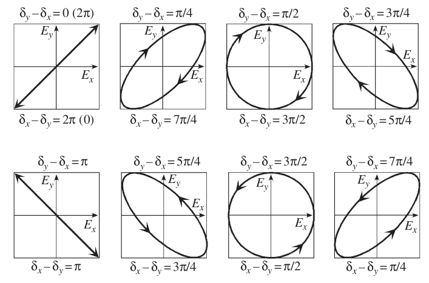

# <ins>Theory</ins>

An electromangetic wave travelling in the $z$-direction can be described as a linear combination of basis electric fields $\mathbf{E}_{x}$ and $\mathbf{E}_{y}$:

$$
\mathbf{E}(z,t) = \mathbf{E}_{x}(x,t) + \mathbf{E}_{y}(y,t) 

\\

\mathbf{E} = \mathbf{E}_{x0}e^{i(\omega t - kz + \delta_x)}\mathbf{\hat{x}} + \mathbf{E}_{y0} e^{i(\omega t - kz + \delta_y)}\mathbf{\hat{y}}
$$

with phase differences $\delta_x$ and $\delta_y$. The phase difference $\delta_x - \delta_y$ will lead to different states of polarization.

<figure>
  
  <figcaption>$\textbf{Figure 1.}$ Polarization states with phase difference $\delta_x - \delta_y$ and $\delta_y - \delta_x$.</figcaption>
</figure>

The Jones vector is then defined using the basis vectors 

$$
\mathbf{\tilde{E}} = 
\begin{pmatrix}
    \mathbf{E}_{x0} e^{i(\omega t - kz + \delta_x)} \\
    \mathbf{E}_{y0} e^{i(\omega t - kz + \delta_y)}
\end{pmatrix}
$$

or in a simplified form

$$
\mathbf{\tilde{E}} = 
\begin{pmatrix}
    \mathbf{\tilde{E}}_{x}\\
    \mathbf{\tilde{E}}_{y}
\end{pmatrix}
$$

Where the light intensity is given as 

$$
I = I_x + I_y = |\mathbf{\tilde{E}}_{x}|^2 + |\mathbf{\tilde{E}}_{y}|^2
$$

